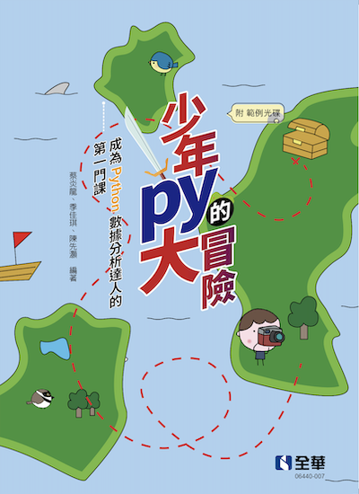

# 110-2 運算思維與程式設計 (Computational Thinking and Programming)
## 簡述
程式碼中有空缺的部分，是為了讓同學於課堂時練習。請依上課之教學進度，並參考教科書，填入程式碼並執行成果。

## 資料來源與教科書
此處的 Jupyter Notebook 與 Python 程式碼，主要來源為本課程之教科書：

書名：《少年Py的大冒險：成為Python數據分析達人的第一門課》

作者：蔡炎龍、季佳琪、陳先灝

出版社：全華圖書

